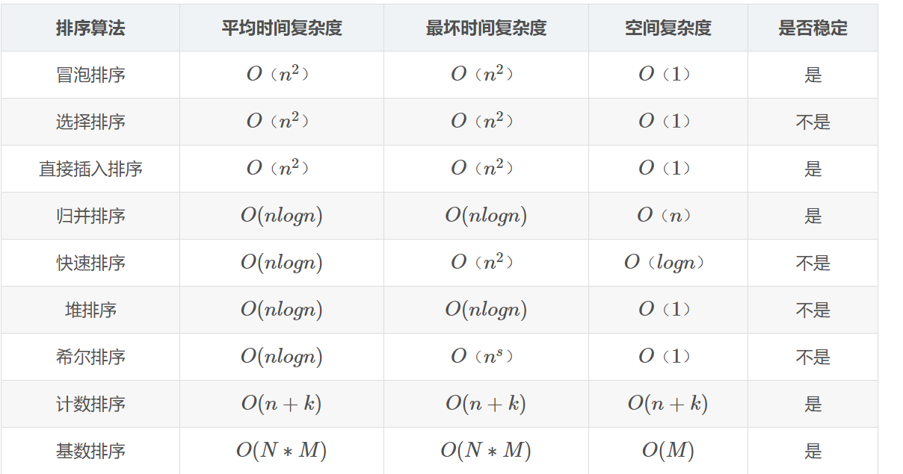

---

# 普通查找和二分查找  <i class="fas fa-coffee"></i>
==2021年02月09日 18时52分30秒 #9C27B0==

## 普通查找
```java
    public static int indexof(int[] arr, int target) {
        
        int res = -1;
        //设置一个最终结果的初始值为-1
       
        for (int i = 0; i < arr.length; i++) {
        //开始循环
            if (arr[i] == target) {
            //如果相等,使得结果等于索引
                res = i;
                break;
            }
        }
        return res;
    }
    //结果返回target索引
```

## 二分查找

```java

    public static int binarySearch(int[] arr, int target) {
        
        int left = 0;      
        //定义起点,也就是左边的游尺
        int right = arr.length - 1;   
        //定义刚刚开始的终点,也就是右边的游尺
        
        while (begin <= end) {      
        //加入循环,使得左游尺永远小于右游尺,如果擦肩而过,就退出循环
            
            int indexOfMid = begin + ((end - begin) >> 1);
            //寻找中间索引
            int mid = arr[indexOfMid];
            //寻找中间索引的值
            
            //接下来,进行判断
            if (target > mid) { 
            
                //左游尺往右走
                begin = indexOfMid + 1;
            } else if (target < mid) { 
            
                //右游尺往左走
                end = indexOfMid - 1;
            } else { 
            
                //如果和中间值相等,返回找到的索引
                return indexOfMid;
            }
        }

        return -1;
        //如果都没有找到,则返回-1
    }

```
---


# 冒泡排序
==2021年02月10日 13时25分40秒 #CDDC39==
```java

/**
 * 冒泡排序
 */
public class bubbleSort {

    public static void main(String[] args) {
        int[] a = new int[]{9, 6, 8, 3, 0, 1};
        bubblesort(a);
        System.out.println("\n--------华丽的分割线--------");
//        for (int num : a)
//            System.out.println(num);
        System.out.println(Arrays.toString(a));
    }
    
    private static void bubblesort(int[] arr) {
        
        int i, j;
        //定义两个变量,i控制大循环,j控制小比较,
        
        for (i = 0; i < arr.length - 1; i++)

            for (j = 0; j < arr.length - i - 1; j++) {
                //这个for的j使得程序不去管理排好了的结尾的数 (-i)
                if (arr[j] > arr[j + 1]) {

                    //如果当前位置更大,进行交换
                    int t = arr[j];
                    arr[j] = arr[j + 1];
                    arr[j + 1] = t;
                }
            }

    }
}
```
# 选择排序
==2021年02月10日 16时41分52秒 #9C27B0==
```java
    //array[]为待排序数组，n为数组长度

    void selectSort(int array[], int n) {
        int i, j, min, k;
        for (i = 0; i < n - 1; i++) {
        
            min = i; //每趟排序最小值先等于第一个数，遍历剩下的数
            for (j = i + 1; j < n; j++){
                 //从i下一个数开始检查
                if (array[min] > array[j]) {
                    min = j;
                }
            }
            
            //如果min和j交换了,就是找到了比j大的值,就让min的值和最开始的赋的索引i的值交换
            if (min != i) {
                k = array[min];
                array[min] = array[i];
                array[i] = k;
            }
        }

    }
```


